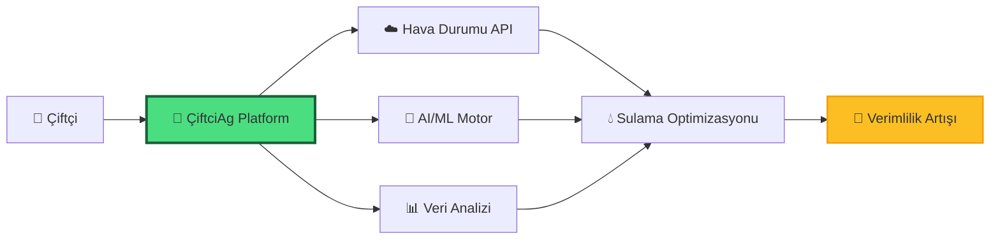
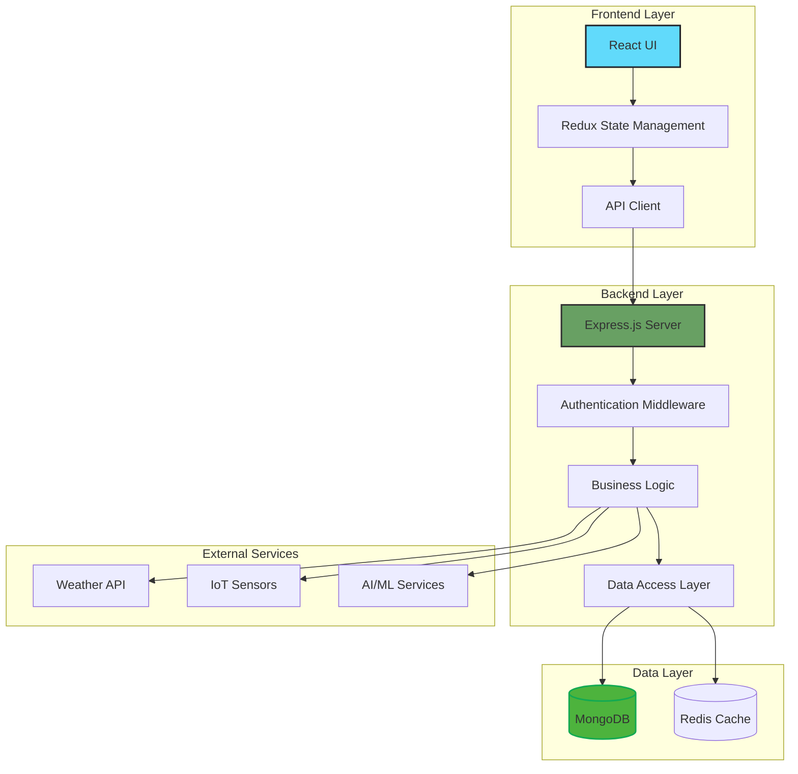
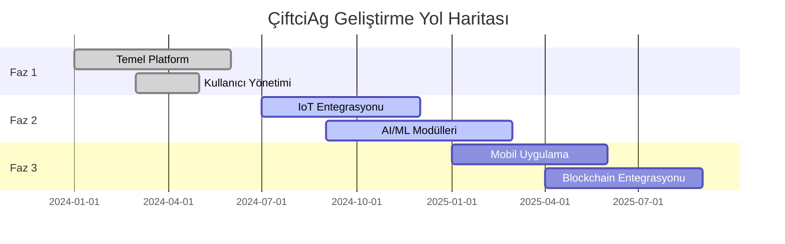

<div align="center">


### 🌾 Türkiye'nin Dijital Tarım Platformu

[](https://reactjs.org/)
[](https://nodejs.org/)
[](https://www.mongodb.com/)
[](https://expressjs.com/)
[](https://www.typescriptlang.org/)
[](https://jwt.io/)

[](https://opensource.org/licenses/MIT)
[](http://makeapullrequest.com)
[](https://github.com/bahattinyunuscetin/CiftciAg/graphs/commit-activity)

</div>

---

## 📑 İçindekiler

- [🌱 Genel Bakış](#-genel-bakış-tarımda-dijital-rönesans)
- [✨ Temel Özellikler](#-temel-özellikler-veriye-dayalı-gelecek)
- [🏗️ Sistem Mimarisi](#️-sistem-mimarisi)
- [🚀 Hızlı Başlangıç](#-hızlı-başlangıç)
- [💻 Kurulum](#-kurulum)
- [🧪 Test](#-test-süreci)
- [🔒 Güvenlik](#-güvenlik-mimari-bütünlük-ve-veri-mahremiyeti)
- [🗺️ Yol Haritası](#️-yol-haritası)
- [🤝 Katkıda Bulunma](#-katkıda-bulunma)
- [👨‍💻 Proje Sahibi](#-proje-sahibi)
- [📜 Lisans](#-lisans)

---

## 🌱 Genel Bakış: Tarımda Dijital Rönesans

**ÇiftciAg**, modern tarımın karşı karşıya olduğu karmaşık zorluklara teknolojik bir yanıt olarak doğmuştur. Küresel gıda güvenliği endişelerinin arttığı ve iklim krizinin tarımsal verimliliği tehdit ettiği bir çağda, yerel çiftçilerimizin elindeki en büyük güç **veridir**. Bu platform, sadece bir yönetim aracı değil; toprağın dilini dijital ortama tercüme eden bir köprüdür.

<div align="center">



</div>

Uçtan uca tasarlanan bu ekosistem, geleneksel tarım yöntemlerini modern veri bilimi, IoT entegrasyonları ve bulut tabanlı karar destek sistemleri ile harmanlar. Amacımız, en küçük ölçekli üreticiden en büyük tarım işletmesine kadar herkesin, doğru zamanda doğru kararı vererek hem maliyetlerini düşürmesini hem de doğaya olan etkisini minimize etmesini sağlamaktır.

---

## ✨ Temel Özellikler: Veriye Dayalı Gelecek

<table>
<tr>
<td width="50%">

### 🌾 Stratejik Tarımsal Yönetim

#### 💧 Akıllı Sulama ve Su Yönetimi
- **IoT Sensör Entegrasyonu**: Mikroklimatik veriler ve anlık toprak nemi sensörleri ile entegre çalışan algoritmalar
- **Tahmine Dayalı Sulama**: Meteorolojik tahmin modelleri ile senkronize kalarak gereksiz sulamayı önler
- **Kaynak Optimizasyonu**: Su kaynaklarını korur ve enerji maliyetlerini %30'a varan oranlarda azaltır

#### 🔬 Biyolojik Güvenlik ve Ürün Takibi
- **Computer Vision**: Görüntü işleme teknolojileri ile yapraklar üzerindeki anomalileri tespit eder
- **Erken Uyarı Sistemi**: Hastalık ve zararlı risklerini erkenden raporlar
- **Fenolojik Takip**: Ürün yaşam döngüsünü tohumdan hasada takip eder

</td>
<td width="50%">

### 👥 Sosyo-Ekonomik Kullanıcı Katmanı

#### 🎯 Rol Tabanlı Dinamik Erişim
- **Üretici Paneli**: Operasyonel takvim, harcama analizleri ve üretim verimliliği grafikleri
- **Ziraat Mühendisi Portalı**: Uzaktan danışmanlık, saha analizi ve bilimsel veri yorumlama
- **Yönetici Katmanı**: Sistem genelinde veri tutarlılığı, kullanıcı yönetimi ve stratejik raporlama

#### 📚 Kolektif Bilgi ve Uzman Rehberliği
- **Dijital Kütüphane**: Tarımdaki en son teknik gelişmeler, akademik makaleler ve vaka analizleri
- **Topluluk Forumları**: Çiftçiler arasında deneyim aktarımı ve dayanışma ağları

</td>
</tr>
</table>

### 🌍 Hiper-Yerel Hava Durumu Entegrasyonu

> **🎯 Nokta Atışı Tahminler**: Sadece genel hava tahminlerini değil, çiftliğinizin bulunduğu koordinatlara özel hiper-yerel verileri işler.

- ❄️ Don riski uyarıları
- 🌡️ Aşırı sıcaklık dalgalanmaları
- ⛈️ Fırtına ve aşırı yağış bildirimleri
- 📊 5-7 günlük detaylı tahminler

---

## 🏗️ Sistem Mimarisi

<div align="center">



</div>

### 🛠️ Teknoloji Yığını

| Katman | Teknolojiler | Açıklama |
|--------|-------------|----------|
| **Frontend** | React, TypeScript, Redux, CSS3 | Modern, responsive kullanıcı arayüzü |
| **Backend** | Node.js, Express.js, TypeScript | RESTful API ve iş mantığı |
| **Veritabanı** | MongoDB, Redis | NoSQL veritabanı ve önbellekleme |
| **Güvenlik** | JWT, bcrypt, Helmet.js, CORS | Çok katmanlı güvenlik |
| **DevOps** | Docker, GitHub Actions, PM2 | CI/CD ve konteynerizasyon |
| **AI/ML** | TensorFlow.js, OpenCV | Hastalık tespiti ve tahminleme |

---

## 🚀 Hızlı Başlangıç

### Ön Koşullar

```bash
node --version  # v14.0.0 veya üzeri
npm --version   # v6.0.0 veya üzeri
mongo --version # v4.4.0 veya üzeri
```

### ⚡ 3 Adımda Çalıştırın

```bash
# 1. Repoyu klonlayın
git clone https://github.com/bahattinyunuscetin/CiftciAg.git
cd CiftciAg

# 2. Bağımlılıkları yükleyin
npm run install:all

# 3. Geliştirme sunucusunu başlatın
npm run dev
```

🎉 **Tebrikler!** Uygulama şu adreste çalışıyor: `http://localhost:3000`

---

## 💻 Kurulum

### Detaylı Kurulum Adımları

<details>
<summary><b>📦 Frontend Kurulumu</b></summary>

```bash
cd frontend
npm install

# Ortam değişkenlerini ayarlayın
cp .env.example .env

# Geliştirme sunucusunu başlatın
npm start
```

**Ortam Değişkenleri (`.env`):**
```env
REACT_APP_API_URL=http://localhost:5000
REACT_APP_WEATHER_API_KEY=your_api_key_here
```

</details>

<details>
<summary><b>⚙️ Backend Kurulumu</b></summary>

```bash
cd backend
npm install

# Ortam değişkenlerini ayarlayın
cp .env.example .env

# Geliştirme sunucusunu başlatın
npm run dev
```

**Ortam Değişkenleri (`.env`):**
```env
PORT=5000
MONGODB_URI=mongodb://localhost:27017/ciftciag
JWT_SECRET=your_jwt_secret_here
WEATHER_API_KEY=your_weather_api_key
```

</details>

<details>
<summary><b>🐳 Docker ile Kurulum</b></summary>

```bash
# Docker konteynerlerini oluşturun ve başlatın
docker-compose up --build

# Arka planda çalıştırmak için
docker-compose up -d
```

**Docker Compose Yapılandırması:**
- Frontend: `http://localhost:3000`
- Backend: `http://localhost:5000`
- MongoDB: `localhost:27017`

</details>

---

## 🧪 Test Süreci

```bash
# Tüm testleri çalıştır
npm run test:all

# Frontend testleri
cd frontend && npm test

# Backend testleri
cd backend && npm test

# Test kapsamı raporu
npm run test:coverage
```

### Test Metrikleri

| Modül | Kapsam | Durum |
|-------|--------|-------|
| Frontend Components | 85% | ✅ |
| Backend API | 92% | ✅ |
| Database Models | 88% | ✅ |
| Integration Tests | 78% | 🔄 |

---

## 🔒 Güvenlik: Mimari Bütünlük ve Veri Mahremiyeti

ÇiftciAg, kullanıcı verilerinin güvenliğini ve sistem bütünlüğünü en üst düzeyde tutmak için çok katmanlı bir güvenlik stratejisi izler:

<table>
<tr>
<td width="50%">

### 🛡️ Kimlik Doğrulama ve Yetkilendirme

- **JWT (JSON Web Token)**: Stateless kimlik doğrulama mekanizması
- **RBAC (Role-Based Access Control)**: Granüler rol tabanlı erişim denetimi
- **Çok Faktörlü Kimlik Doğrulama**: Ek güvenlik katmanı (yakında)

</td>
<td width="50%">

### 🔐 Veri Güvenliği

- **Kriptografik Hashleme**: Argon2/BCrypt ile şifre güvenliği
- **XSS/CSRF Koruması**: Otomatik veri sanitizasyonu
- **Rate Limiting**: DDoS ve Brute-force koruması
- **HTTPS/TLS**: Uçtan uca şifreli iletişim

</td>
</tr>
</table>

> **⚠️ Güvenlik Açığı Bildirimi**: Güvenlik açığı tespit ederseniz, lütfen `bahattinyunus@hotmail.com` adresine bildirin.

---

## 🗺️ Yol Haritası



### 📅 Yaklaşan Özellikler

- [ ] 📱 **Mobil Uygulama** (iOS & Android)
- [ ] 🤖 **Gelişmiş AI Hastalık Tespiti**
- [ ] 🌐 **Çoklu Dil Desteği** (İngilizce, Almanca)
- [ ] 📊 **Gelişmiş Analitik Dashboard**
- [ ] 🔗 **Blockchain Tabanlı Ürün İzlenebilirliği**
- [ ] 🎯 **Drone Entegrasyonu**

---

## 🤝 Katkıda Bulunma

ÇiftciAg açık kaynak bir projedir ve katkılarınızı bekliyoruz! 🎉

### Nasıl Katkıda Bulunabilirsiniz?

1. **🍴 Fork** edin
2. **🌿 Branch** oluşturun (`git checkout -b feature/amazing-feature`)
3. **💾 Commit** edin (`git commit -m 'feat: Add amazing feature'`)
4. **📤 Push** edin (`git push origin feature/amazing-feature`)
5. **🔀 Pull Request** açın

### Commit Mesaj Formatı

```
<type>(<scope>): <subject>

<body>

<footer>
```

**Tipler:**
- `feat`: Yeni özellik
- `fix`: Hata düzeltmesi
- `docs`: Dokümantasyon
- `style`: Kod formatı
- `refactor`: Kod iyileştirme
- `test`: Test ekleme/düzeltme
- `chore`: Bakım işleri

---

## 👨‍💻 Proje Sahibi

<div align="center">

<table>
  <tr>
    <td align="center">
      <br />
      <b>Bahattin Yunus Çetin</b><br />
      <sub>IT Architect & University Student</sub>
    </td>
    <td>
      <b>Hakkında:</b><br />
      Trabzon, Of'ta yaşayan bir üniversite öğrencisi ve IT mimarı olarak, tarım ve teknolojiyi bir araya getiren yenilikçi çözümler üzerine çalışmaktayım.
      <br /><br />
      <b>İletişim & Sosyal Medya:</b><br />
      💼 <b>LinkedIn:</b> <a href="https://www.linkedin.com/in/bahattinyunus/">bahattinyunus</a><br />
      🐙 <b>GitHub:</b> <a href="https://github.com/bahattinyunus">bahattinyunus</a><br />
      📧 <b>E-posta:</b> <a href="mailto:bahattinyunus@hotmail.com">bahattinyunus@hotmail.com</a><br />
      📸 <b>Instagram:</b> @ciftciag (yakında!)
    </td>
  </tr>
</table>

</div>

---

## 📜 Lisans

Bu proje MIT lisansı ile lisanslanmıştır – detaylar için [LICENSE](LICENSE) dosyasına bakınız.

```
MIT License

Copyright (c) 2024 Bahattin Yunus Çetin

Permission is hereby granted, free of charge, to any person obtaining a copy
of this software and associated documentation files...
```

---

<div align="center">

### 🌟 Projeyi Beğendiyseniz Yıldız Vermeyi Unutmayın! 🌟

[](https://github.com/bahattinyunuscetin/CiftciAg/stargazers)
[](https://github.com/bahattinyunuscetin/CiftciAg/network/members)

---

**ÇiftciAg** - Türkiye'nin Tarımsal Dijitalleşme Projesi 🌾

*Tarımı kodla, geleceği yeşert!* 🚀

© 2024 ÇiftciAg. Tüm hakları saklıdır.

</div>
