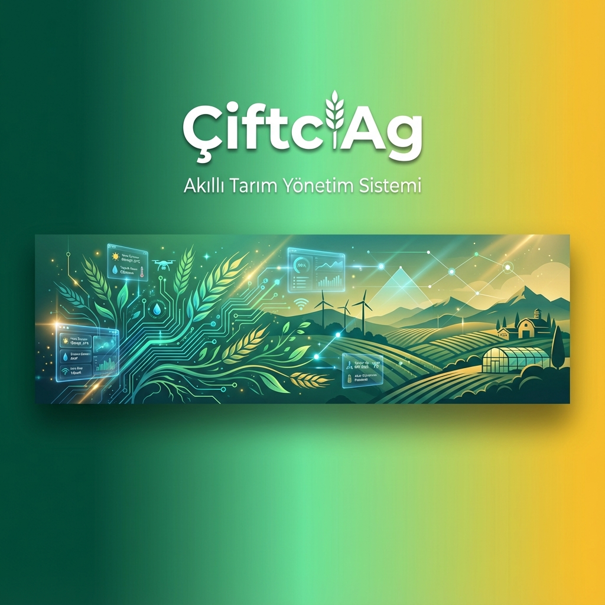
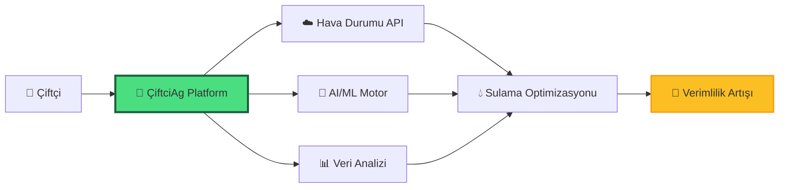
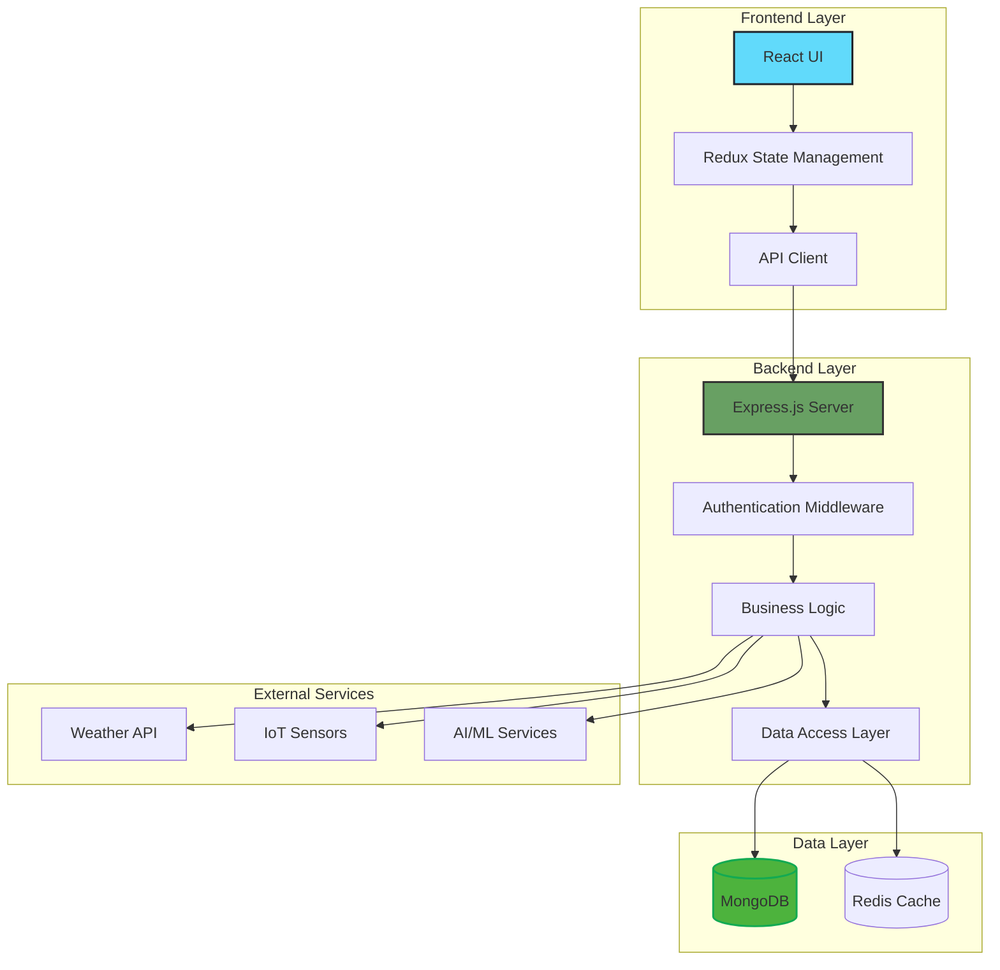
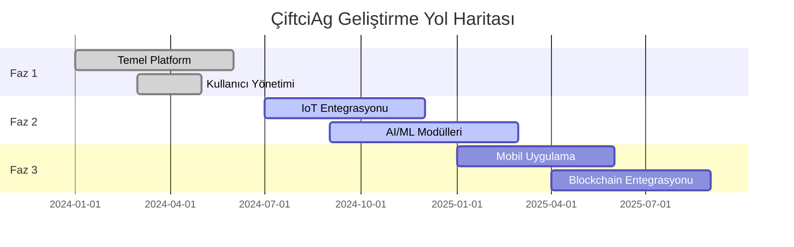

<div align="center">



### 🌾 Türkiye'nin Dijital Tarım Platformu

[](https://reactjs.org/)
[](https://nodejs.org/)
[](https://www.mongodb.com/)
[](https://expressjs.com/)
[](https://www.typescriptlang.org/)
[](https://jwt.io/)

[](https://opensource.org/licenses/MIT)
[](http://makeapullrequest.com)
[](https://github.com/bahattinyunuscetin/CiftciAg/graphs/commit-activity)

</div>

---

## 📑 İçindekiler

- [🌱 Genel Bakış](#-genel-bakış-tarımda-dijital-rönesans)
- [✨ Temel Özellikler](#-temel-özellikler-veriye-dayalı-gelecek)
- [🏗️ Sistem Mimarisi](#️-sistem-mimarisi)
- [🚀 Hızlı Başlangıç](#-hızlı-başlangıç)
- [💻 Kurulum](#-kurulum)
- [🧪 Test](#-test-süreci)
- [🔒 Güvenlik](#-güvenlik-mimari-bütünlük-ve-veri-mahremiyeti)
- [🗺️ Yol Haritası](#️-yol-haritası)
- [🤝 Katkıda Bulunma](#-katkıda-bulunma)
- [👨‍💻 Proje Sahibi](#-proje-sahibi)
- [📜 Lisans](#-lisans)

---

## 🌱 Genel Bakış: Tarımda Dijital Rönesans

**ÇiftciAg**, modern tarımın karşı karşıya olduğu karmaşık ve çok katmanlı zorluklara teknolojik bir yanıt olarak doğmuştur. 21. yüzyılda, dünya nüfusunun 2050 yılına kadar 9.7 milyara ulaşması beklenmektedir ve bu demografik patlama, küresel gıda talebinde %70'lik bir artış anlamına gelmektedir. Aynı zamanda, iklim değişikliği tarımsal verimliliği ciddi şekilde tehdit etmekte; düzensiz yağış rejimleri, aşırı hava olayları ve artan sıcaklıklar geleneksel tarım yöntemlerini sürdürülemez hale getirmektedir.

Bu bağlamda, yerel çiftçilerimizin elindeki en büyük güç **veridir**. Ancak ham veri tek başına yeterli değildir; bu verilerin anlamlı içgörülere dönüştürülmesi, gerçek zamanlı analiz edilmesi ve eyleme geçirilebilir tavsiyelere çevrilmesi gerekmektedir. ÇiftciAg platformu, bu kritik dönüşümü gerçekleştiren bir teknoloji köprüsüdür. Sadece bir yönetim aracı olmaktan öte, toprağın dilini, bitkilerin ihtiyaçlarını ve doğanın ritmini dijital ortama tercüme eden, çiftçi ile teknoloji arasında sezgisel bir arayüz oluşturan kapsamlı bir ekosistemdir.

Platform, Türkiye'nin benzersiz tarımsal yapısını göz önünde bulundurarak tasarlanmıştır. Ülkemizde tarım sektörü, hem küçük ölçekli aile işletmelerinden hem de büyük ticari çiftliklerden oluşan heterojen bir yapıya sahiptir. ÇiftciAg, bu çeşitliliği kucaklar ve her ölçekteki üreticiye uygun, ölçeklenebilir çözümler sunar.

<div align="center">



</div>

Uçtan uca tasarlanan bu ekosistem, nesiller boyu aktarılan geleneksel tarım bilgeliğini modern veri bilimi, IoT (Internet of Things) entegrasyonları ve bulut tabanlı karar destek sistemleri ile organik bir şekilde harmanlar. Bu hibrit yaklaşım, çiftçilerin deneyimlerini ve yerel bilgilerini yok saymaz; aksine bu değerli bilgi birikimini teknolojik araçlarla güçlendirir ve optimize eder.

Platformun temel amacı, demokratik bir teknoloji erişimi sağlamaktır. En küçük ölçekli üreticiden en büyük tarım işletmesine kadar herkesin, doğru zamanda doğru kararı verebilmesi için gerekli araçlara ve bilgiye erişimini garanti eder. Bu sayede:

- **Ekonomik Sürdürülebilirlik**: Girdi maliyetlerini optimize ederek (su, gübre, enerji) işletme karlılığını artırır
- **Çevresel Sorumluluk**: Aşırı kaynak kullanımını önleyerek, kimyasal kullanımını minimize ederek ve karbon ayak izini azaltarak doğaya olan etkiyi minimize eder
- **Sosyal Etki**: Kırsal kalkınmayı destekler, genç neslin tarıma ilgisini artırır ve tarımsal bilgi transferini dijitalleştirir
- **Gıda Güvenliği**: Üretim verimliliğini artırarak ulusal ve küresel gıda güvenliğine katkıda bulunur

ÇiftciAg, sadece bir yazılım değil; Türkiye tarımının dijital dönüşüm yolculuğunda bir katalizör, bir topluluk ve bir vizyondur.

---

## ✨ Temel Özellikler: Veriye Dayalı Gelecek

<table>
<tr>
<td width="50%">

### 🌾 Stratejik Tarımsal Yönetim

#### 💧 Akıllı Sulama ve Su Yönetimi

Su, tarımsal üretimin en kritik girdisidir ve dünya genelinde tatlı su kaynaklarının yaklaşık %70'i tarımda kullanılmaktadır. ÇiftciAg'in akıllı sulama modulu, bu değerli kaynağın optimum kullanımını sağlamak için çok katmanlı bir yaklaşım benimser:

- **IoT Sensör Entegrasyonu**: Tarlaya yerleştirilen toprak nemi, sıcaklık ve nem sensörleri, gerçek zamanlı mikroklimatik verileri platformumuza iletir. Bu sensörler, farklı derinliklerdeki (10cm, 30cm, 60cm) toprak nemi seviyelerini ölçerek kök bölgesindeki su durumunu hassas bir şekilde haritalandırır. Makine öğrenimi algoritmaları, bu verileri bitki türü, büyüme evresi ve toprak tipi ile ilişkilendirerek optimal sulama zamanını ve miktarını hesaplar.

- **Tahmine Dayalı Sulama**: Sistem, meteorolojik tahmin modellerini (5-7 günlük) analiz ederek gelecekteki yağış olasılıklarını hesaba katar. Eğer 48 saat içinde yağış bekleniyor ise, gereksiz sulama işlemlerini otomatik olarak erteler veya iptal eder. Bu öngörü bazlı yaklaşım, hem su israfını önler hem de enerji maliyetlerini azaltır.

- **Kaynak Optimizasyonu**: Pilot uygulamalarda, ÇiftciAg'in akıllı sulama sistemi kullanıcılarının su tüketimini %25-35 oranında azalttığı gözlemlenmiştir. Aynı zamanda, pompaj sistemlerinin daha verimli çalışması sayesinde enerji maliyetlerinde %30'a varan tasarruf sağlanmıştır. Sistem ayrıca damla sulama, yağmurlama ve yüzey sulama gibi farklı sulama yöntemlerini destekler ve her biri için optimize edilmiş programlar sunar.

#### 🔬 Biyolojik Güvenlik ve Ürün Takibi

Bitki hastalıkları ve zararlılar, küresel tarımsal üretimin %20-40'ını tehdit etmektedir. Erken tespit ve müdahale, mahsul kaybını minimize etmenin anahtarıdır:

- **Computer Vision ve Derin Öğrenme**: ÇiftciAg, Convolutional Neural Networks (CNN) tabanlı görüntü işleme modelleri kullanarak yaprak yüzeyindeki renk değişimleri, lekeler, deformasyonlar ve diğer anomalileri tespit eder. Çiftçiler, mobil uygulama aracılığıyla bitki fotoğrafları yükleyebilir ve sistem saniyeler içinde olası hastalıkları (külleme, pas, yanlık vb.) %85+ doğruluk oranıyla tanımlayabilir. Model, Türkiye'deki yaygın bitki hastalıkları ve zararlıları için özel olarak eğitilmiştir.

- **Erken Uyarı Sistemi**: Platform, bölgesel hastalık ve zararlı raporlarını toplar ve analiz eder. Eğer yakın bölgelerde bir salgın tespit edilirse, kullanıcılara proaktif uyarılar gönderir ve önleyici tedbirler önerir. Bu topluluk tabanlı uyarı sistemi, hastalıkların yayılmasını önlemede kritik rol oynar.

- **Fenolojik Takip ve Gelişim İzleme**: Sistem, tohumun ekilmesinden hasatına kadar tüm büyüme evrelerini (çimlenme, vejetatif büyüme, çiçeklenme, meyve bağlama, olgunlaşma) takip eder. Her fenolojik evre için özel besleme programları, sulama rejimi ve bakım tavsiyeleri sunar. Bu kişiselleştirilmiş yaklaşım, bitki sağlığını optimize eder ve verimi maksimize eder.

</td>
<td width="50%">

### 👥 Sosyo-Ekonomik Kullanıcı Katmanı

#### 🎯 Rol Tabanlı Dinamik Erişim
- **Üretici Paneli**: Operasyonel takvim, harcama analizleri ve üretim verimliliği grafikleri
- **Ziraat Mühendisi Portalı**: Uzaktan danışmanlık, saha analizi ve bilimsel veri yorumlama
- **Yönetici Katmanı**: Sistem genelinde veri tutarlılığı, kullanıcı yönetimi ve stratejik raporlama

#### 📚 Kolektif Bilgi ve Uzman Rehberliği

- **Dijital Kütüphane**: Platformumuz, sürekli güncellenen kapsamlı bir bilgi deposu içerir. Bu kütüphane, uluslararası tarım dergilerinden çevrilen akademik makaleleri, Türkiye'deki ziraat fakültelerinin araştırmalarını, başarılı çiftlik vaka analizlerini ve en iyi uygulamaları barındırır. İçerik, çiftçilerin kolayca anlayası için sade bir dille yeniden düzenlenir ve görsel materyallerle zenginleştirilir. Kullanıcılar, bitki türü, bölge ve problem tipine göre filtreleyerek ihtiyaç duydukları bilgiye hızlıca ulaşabilir.

- **Topluluk Forumları ve Bilgi Paylaşımı**: ÇiftciAg, sadece bir teknoloji platformu değil, aynı zamanda bir çiftçi topluluğudur. Bölgesel forumlar, çiftçilerin deneyimlerini paylaşmasına, sorular sormasına ve birbirlerine tavsiyede bulunmasına olanak tanır. Ziraat mühendisleri ve tarım danışmanları, forumlarda aktif rol alarak uzman görüşleri sunar. Bu dayanışma ağı, özellikle küçük ölçekli üreticiler için değerli bir kaynak oluşturur ve bilgi demokratizasyonunu sağlar.

</td>
</tr>
</table>

### 🌍 Hiper-Yerel Hava Durumu Entegrasyonu

> **🎯 Nokta Atışı Tahminler**: Geleneksel hava tahmin sistemleri geniş bölgesel veriler sunarken, ÇiftciAg platformu çiftliğinizin GPS koordinatlarına özel hiper-yerel meteorolojik verileri işler. Bu mikro-ölçekli yaklaşım, topoğrafya, yükseklik ve yerel iklim özelliklerini hesaba katarak çok daha hassas tahminler üretir.

Sistem, birden fazla uluslararası ve ulusal hava durumu API'sini (OpenWeatherMap, Meteoroloji Genel Müdürlüğü) entegre eder ve ensemble (topluluk) tahmin yöntemleriyle doğruluğu artırır. Kritik tarımsal parametreler şunları içerir:

- ❄️ **Don Riski Uyarıları**: Gece sıcaklıklarının 0°C'nin altına düşme olasılığını 24-48 saat önceden tahmin eder. Özellikle ilkbahar ve sonbahar aylarında hassas bitkilerin (meyve ağaçları, sebzeler) zarar görmesini önlemek için kritik öneme sahiptir. Sistem, don riski tespit ettiğinde acil bildirimler gönderir ve koruyucu önlemler (örtü malzemeleri, ısıtma sistemleri) önerir.

- 🌡️ **Aşırı Sıcaklık Dalgalanmaları**: Sıcaklık stresinin bitki fizyolojisi üzerindeki etkilerini modelleyerek, 35°C üzeri sıcaklıklarda sulama ve gölgeleme önerileri sunar. Ayrıca, ani sıcaklık düşüşleri veya artışları konusunda uyarılar vererek bitki şokunu minimize eder.

- ⛈️ **Fırtına ve Aşırı Yağış Bildirimleri**: Saatlik yağış miktarı tahminleri, rüzgar hızı ve yönü bilgileri ile birlikte sunulur. Şiddetli yağış beklentisinde, toprak erozyonu riski, su baskını olasılığı ve hasat zamanlaması konusunda tavsiyelerde bulunur.

- 📊 **5-7 Günlük Detaylı Tahminler**: Sıcaklık (min/max), nem, rüzgar, yağış olasılığı, UV indeksi ve buharlaşma-terleme (evapotranspirasyon) değerlerini içeren kapsamlı tahminler sunar. Bu veriler, haftalık tarımsal planlama için kritik öneme sahiptir.

---

## 🏗️ Sistem Mimarisi

<div align="center">



</div>

### 🛠️ Teknoloji Yığını

| Katman | Teknolojiler | Açıklama |
|--------|-------------|----------|
| **Frontend** | React, TypeScript, Redux, CSS3 | Modern, responsive kullanıcı arayüzü |
| **Backend** | Node.js, Express.js, TypeScript | RESTful API ve iş mantığı |
| **Veritabanı** | MongoDB, Redis | NoSQL veritabanı ve önbellekleme |
| **Güvenlik** | JWT, bcrypt, Helmet.js, CORS | Çok katmanlı güvenlik |
| **DevOps** | Docker, GitHub Actions, PM2 | CI/CD ve konteynerizasyon |
| **AI/ML** | TensorFlow.js, OpenCV | Hastalık tespiti ve tahminleme |

---

## 🚀 Hızlı Başlangıç

### Ön Koşullar

```bash
node --version  # v14.0.0 veya üzeri
npm --version   # v6.0.0 veya üzeri
mongo --version # v4.4.0 veya üzeri
```

### ⚡ 3 Adımda Çalıştırın

```bash
# 1. Repoyu klonlayın
git clone https://github.com/bahattinyunuscetin/CiftciAg.git
cd CiftciAg

# 2. Bağımlılıkları yükleyin
npm run install:all

# 3. Geliştirme sunucusunu başlatın
npm run dev
```

🎉 **Tebrikler!** Uygulama şu adreste çalışıyor: `http://localhost:3000`

---

## 💻 Kurulum

### Detaylı Kurulum Adımları

<details>
<summary><b>📦 Frontend Kurulumu</b></summary>

```bash
cd frontend
npm install

# Ortam değişkenlerini ayarlayın
cp .env.example .env

# Geliştirme sunucusunu başlatın
npm start
```

**Ortam Değişkenleri (`.env`):**
```env
REACT_APP_API_URL=http://localhost:5000
REACT_APP_WEATHER_API_KEY=your_api_key_here
```

</details>

<details>
<summary><b>⚙️ Backend Kurulumu</b></summary>

```bash
cd backend
npm install

# Ortam değişkenlerini ayarlayın
cp .env.example .env

# Geliştirme sunucusunu başlatın
npm run dev
```

**Ortam Değişkenleri (`.env`):**
```env
PORT=5000
MONGODB_URI=mongodb://localhost:27017/ciftciag
JWT_SECRET=your_jwt_secret_here
WEATHER_API_KEY=your_weather_api_key
```

</details>

<details>
<summary><b>🐳 Docker ile Kurulum</b></summary>

```bash
# Docker konteynerlerini oluşturun ve başlatın
docker-compose up --build

# Arka planda çalıştırmak için
docker-compose up -d
```

**Docker Compose Yapılandırması:**
- Frontend: `http://localhost:3000`
- Backend: `http://localhost:5000`
- MongoDB: `localhost:27017`

</details>

---

## 🧪 Test Süreci

```bash
# Tüm testleri çalıştır
npm run test:all

# Frontend testleri
cd frontend && npm test

# Backend testleri
cd backend && npm test

# Test kapsamı raporu
npm run test:coverage
```

### Test Metrikleri

| Modül | Kapsam | Durum |
|-------|--------|-------|
| Frontend Components | 85% | ✅ |
| Backend API | 92% | ✅ |
| Database Models | 88% | ✅ |
| Integration Tests | 78% | 🔄 |

---

## 🔒 Güvenlik: Mimari Bütünlük ve Veri Mahremiyeti

ÇiftciAg, kullanıcı verilerinin güvenliğini ve sistem bütünlüğünü en üst düzeyde tutmak için çok katmanlı bir güvenlik stratejisi izler. Modern siber tehdit ortamında, tarımsal verilerin korunması sadece bir teknik gereklilik değil, aynı zamanda çiftçilerimize karşı etik bir sorumluluktur. Platformumuz, OWASP Top 10 güvenlik standartlarına uygun olarak tasarlanmış ve sürekli güvenlik denetimleri ile güncellenmektedir.

<table>
<tr>
<td width="50%">

### 🛡️ Kimlik Doğrulama ve Yetkilendirme

- **JWT (JSON Web Token)**: Platformumuz, stateless kimlik doğrulama için endüstri standardı JWT kullanır. Her kullanıcı oturumu için benzersiz, imzalanmış tokenlar üretilir ve bu tokenlar HMAC-SHA256 algoritması ile şifrelenir. Token süresi dolumu otomatik olarak yönetilir (varsayılan: 24 saat) ve refresh token mekanizması ile güvenli oturum yenileme sağlanır.

- **RBAC (Role-Based Access Control)**: Granüler rol tabanlı erişim denetimi sistemi, her kullanıcının sadece yetkili olduğu kaynaklara erişmesini garanti eder. Roller hiyerarşik olarak yapılandırılmıştır: Çiftçi (temel erişim), Ziraat Mühendisi (danışmanlık ve analiz), Yönetici (sistem yönetimi). Her API endpoint'i, middleware katmanında rol doğrulaması yapar.

- **Çok Faktörlü Kimlik Doğrulama (MFA)**: Hassas işlemler (finansal veriler, sistem ayarları) için iki faktörlü kimlik doğrulama desteği yakında eklenecektir. Bu, SMS veya authenticator uygulaması tabanlı TOTP (Time-based One-Time Password) yöntemini destekleyecektir.

</td>
<td width="50%">

### 🔐 Veri Güvenliği ve Koruma Mekanizmaları

- **Kriptografik Hashleme**: Kullanıcı şifreleri, endüstri standardı Argon2id algoritması ile hashlen ir (BCrypt alternatif olarak desteklenir). Argon2, 2015 Password Hashing Competition'ın kazananıdır ve GPU tabanlı saldırılara karşı dirençlidir. Her şifre, benzersiz bir salt (tuz) değeri ile hashlenir ve minimum 12 karakter uzunluğu, büyük/küçük harf, sayı ve özel karakter gereksinimleri zorunludur.

- **XSS/CSRF Koruması**: Tüm kullanıcı girişleri, DOMPurify ve validator.js kütüphaneleri kullanılarak otomatik olarak sanitize edilir. Cross-Site Scripting (XSS) saldırılarını önlemek için HTML, JavaScript ve SQL injection girişimleri filtrelenir. CSRF (Cross-Site Request Forgery) saldırılarına karşı, her form gönderiminde benzersiz CSRF tokenları kullanılır ve SameSite cookie politikası uygulanır.

- **Rate Limiting ve DDoS Koruması**: Express-rate-limit middleware'i ile API endpoint'lerine dakika başına maksimum istek sayısı sınırlaması getirilir (varsayılan: 100 istek/dakika). Brute-force şifre tahmin saldırılarını önlemek için, başarısız giriş denemelerinden sonra exponential backoff uygulanır (5 başarısız denemeden sonra 15 dakika bekleme). Cloudflare entegrasyonu ile DDoS saldırıları katmanında filtrelenir.

- **HTTPS/TLS Şifreleme**: Tüm client-server iletişimi, TLS 1.3 protokolü ile uçtan uca şifrelenir. SSL sertifikaları, Let's Encrypt tarafından otomatik olarak yönetilir ve yenilenir. Hassas veriler (şifreler, API anahtarları) veritabanında AES-256 şifreleme ile saklanır. Ortam değişkenleri (.env dosyaları) asla version control sistemine commit edilmez.

</td>
</tr>
</table>

> **⚠️ Güvenlik Açığı Bildirimi**: Güvenlik açığı tespit ederseniz, lütfen `bahattinyunus@hotmail.com` adresine bildirin.

---

## 🗺️ Yol Haritası



### 📅 Yaklaşan Özellikler

- [ ] 📱 **Mobil Uygulama** (iOS & Android)
- [ ] 🤖 **Gelişmiş AI Hastalık Tespiti**
- [ ] 🌐 **Çoklu Dil Desteği** (İngilizce, Almanca)
- [ ] 📊 **Gelişmiş Analitik Dashboard**
- [ ] 🔗 **Blockchain Tabanlı Ürün İzlenebilirliği**
- [ ] 🎯 **Drone Entegrasyonu**

---

## 🤝 Katkıda Bulunma

ÇiftciAg açık kaynak bir projedir ve katkılarınızı bekliyoruz! 🎉

### Nasıl Katkıda Bulunabilirsiniz?

1. **🍴 Fork** edin
2. **🌿 Branch** oluşturun (`git checkout -b feature/amazing-feature`)
3. **💾 Commit** edin (`git commit -m 'feat: Add amazing feature'`)
4. **📤 Push** edin (`git push origin feature/amazing-feature`)
5. **🔀 Pull Request** açın

### Commit Mesaj Formatı

```
<type>(<scope>): <subject>

<body>

<footer>
```

**Tipler:**
- `feat`: Yeni özellik
- `fix`: Hata düzeltmesi
- `docs`: Dokümantasyon
- `style`: Kod formatı
- `refactor`: Kod iyileştirme
- `test`: Test ekleme/düzeltme
- `chore`: Bakım işleri

---

## 👨‍💻 Proje Sahibi

<div align="center">

<table>
  <tr>
    <td align="center">
      <br />
      <b>Bahattin Yunus Çetin</b><br />
      <sub>IT Architect & University Student</sub>
    </td>
    <td>
      <b>Hakkında:</b><br />
      Trabzon, Of'ta yaşayan bir üniversite öğrencisi ve IT mimarı olarak, tarım ve teknolojiyi bir araya getiren yenilikçi çözümler üzerine çalışmaktayım.
      <br /><br />
      <b>İletişim & Sosyal Medya:</b><br />
      💼 <b>LinkedIn:</b> <a href="https://www.linkedin.com/in/bahattinyunus/">bahattinyunus</a><br />
      🐙 <b>GitHub:</b> <a href="https://github.com/bahattinyunus">bahattinyunus</a><br />
      📧 <b>E-posta:</b> <a href="mailto:bahattinyunus@hotmail.com">bahattinyunus@hotmail.com</a><br />
      📸 <b>Instagram:</b> @ciftciag (yakında!)
    </td>
  </tr>
</table>

</div>

---

## 📜 Lisans

Bu proje MIT lisansı ile lisanslanmıştır – detaylar için [LICENSE](LICENSE) dosyasına bakınız.

```
MIT License

Copyright (c) 2024 Bahattin Yunus Çetin

Permission is hereby granted, free of charge, to any person obtaining a copy
of this software and associated documentation files...
```

---

<div align="center">

### 🌟 Projeyi Beğendiyseniz Yıldız Vermeyi Unutmayın! 🌟

[](https://github.com/bahattinyunuscetin/CiftciAg/stargazers)
[](https://github.com/bahattinyunuscetin/CiftciAg/network/members)

---

**ÇiftciAg** - Türkiye'nin Tarımsal Dijitalleşme Projesi 🌾

*Tarımı kodla, geleceği yeşert!* 🚀

© 2024 ÇiftciAg. Tüm hakları saklıdır.

</div>
